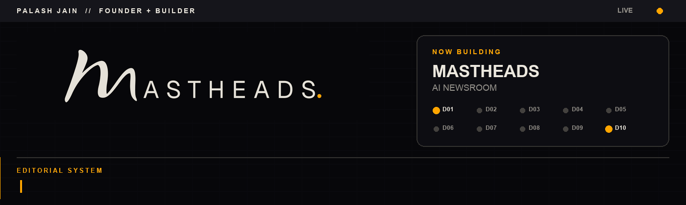

  

  <strong>Founder of <a href="https://mastheads.app">Mastheads</a></strong> 
  Source-backed articles through ten editorial desks.

  <a href="https://mastheads.app"><strong>Product</strong></a>&nbsp;&nbsp;·&nbsp;&nbsp;
  <a href="https://mastheads.app/docs"><strong>Docs</strong></a>&nbsp;&nbsp;·&nbsp;&nbsp;
  <a href="https://github.com/palashjain55/mastheads-mcp"><strong>MCP</strong></a>&nbsp;&nbsp;·&nbsp;&nbsp;
  <a href="https://www.linkedin.com/in/its-palashjain/"><strong>LinkedIn</strong></a>&nbsp;&nbsp;·&nbsp;&nbsp;
  <a href="https://x.com/its_palashjain"><strong>X</strong></a>

<table>
  <tr>
    <td width="50%" valign="top">
      <h3>Building Mastheads</h3>
      
Mastheads writes source-backed articles for publishers, agencies and niche-site operators.

      
Every article shows its sources, checks, named byline and anything the desks could not fix.

      
<a href="https://mastheads.app"><strong>Explore Mastheads →</strong></a>

    </td>
    <td width="50%" valign="top">
      <h3>Working in private</h3>
      
Most of my product engineering, newsroom infrastructure and experiments live in private repositories.

      
This profile is the public front door, not the full inventory.

      
<a href="mailto:hello@mastheads.app"><strong>Start a conversation →</strong></a>

    </td>
  </tr>
</table>

## What I work with

`Python` `TypeScript` `React` `Node.js` `Cloudflare Workers` `PostgreSQL` `AI systems` `Publishing infrastructure`

  
<strong>How I build</strong>

   
  
I care about software that shows its work: sources stay attached, checks stay visible and automation remains reviewable.

  
Mastheads is built around that principle. AI newsroom automation is one product feature, while evidence and editorial decisions stay available to the person responsible for publishing.

  
<strong>Public entry points</strong>

   
  <ul>
    <li><a href="https://mastheads.app">Mastheads</a> - product</li>
    <li><a href="https://mastheads.app/docs">Documentation</a> - guides and product reference</li>
    <li><a href="https://github.com/palashjain55/mastheads-mcp">Mastheads MCP</a> - public connection documentation</li>
  </ul>

---

  Product, partnership or integration conversations: 
  <a href="mailto:hello@mastheads.app"><strong>hello@mastheads.app</strong></a>

